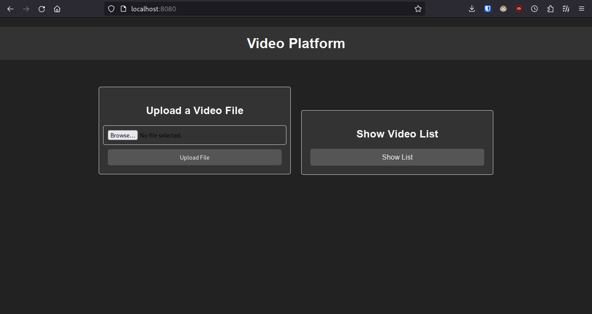
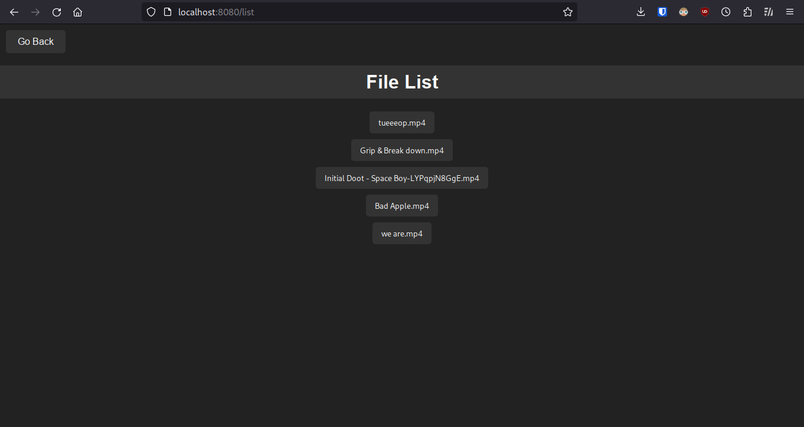
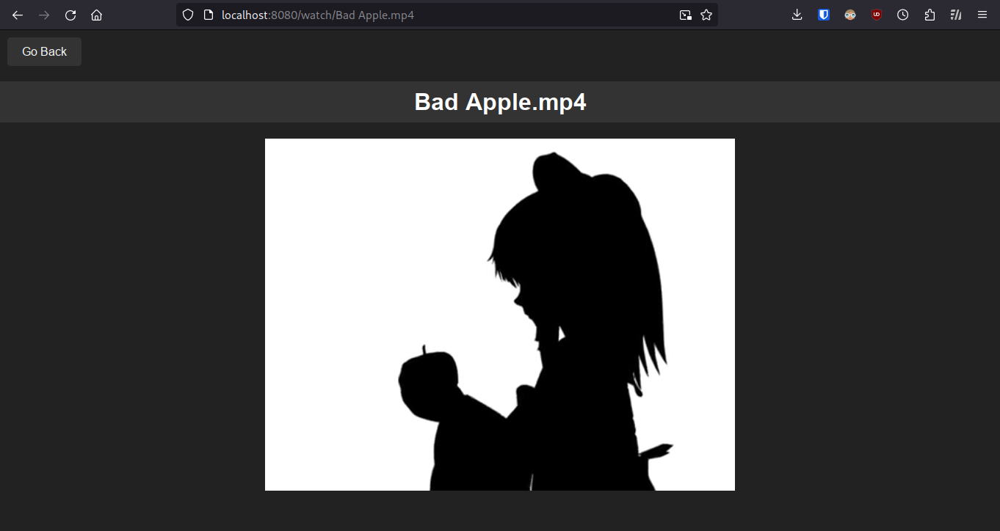
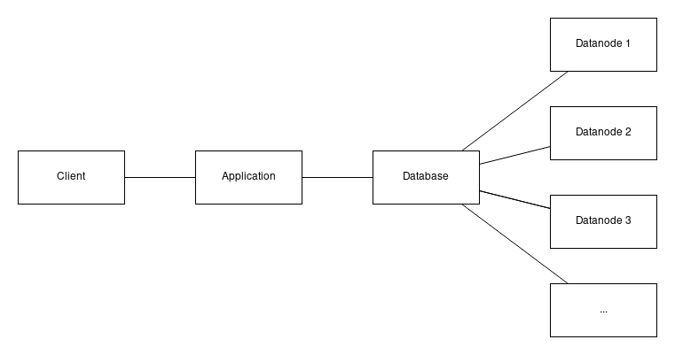

# MyYoutube Stage 3
A distributed video platform written using rpyc.  
To start, run `rpyc_registry`  
Then run `python monitor.py`  
Then run `python database.py`  
Then run `python application.py`  
Then run `python datanode.py` on each computer you want to host a datanode.  
You can run multiple datanodes in one computer by changing the port number on datanode.py  
After starting all datanodes, add their ip and port to datanodes.txt in the computer running the application  

Now open http://localhost:8080 on your browser.  

For how it works, please read the [Documentation](MyYoutube%20-%20Entrega%203.pdf)  
[Github Link](https://github.com/gustavomoura628/MyYoutube-Entrega3)  
  
  
  
  
